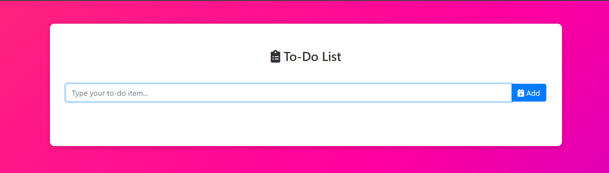
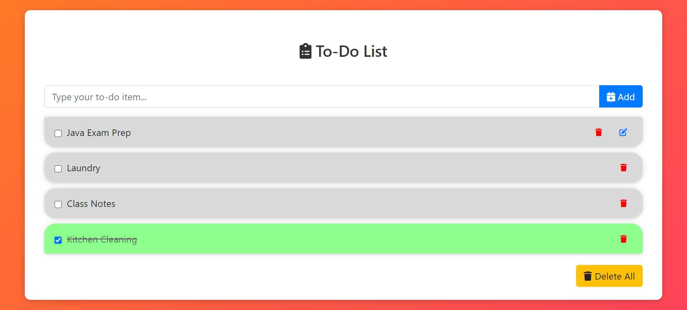

# **To-Do**

## **Introduction**

* #### It is a simple To-Do List with visual design

You can clone & run this site in your PC.

## **Programming Language and Technologies used**

* [x] HTML, CSS & JS

* [x] Visual Studio Code

* [x] Git

## **Resources**

1. Class Notes
2. Google

## **Screenshots**
    

# 
**A Big Thank You!**

